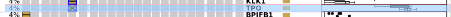
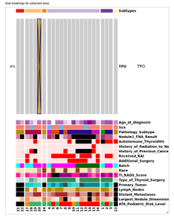
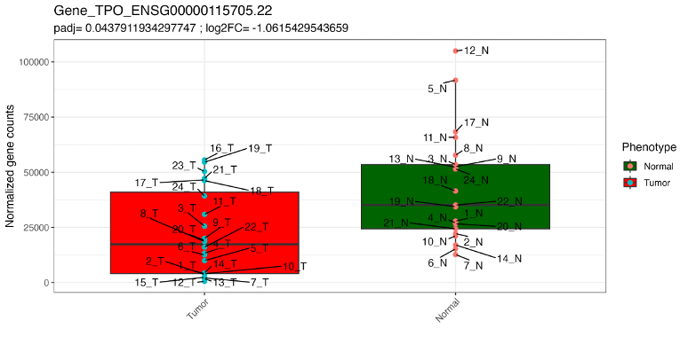
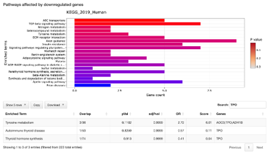

## **About Pediatric Thyroid Cancer Explorer (PTCE)!**

PTCE is a custom-built open-access web resource to browse and explore the results discussed in the manuscript on integrated whole-exome and transcriptome from 45 formalin-fixed paraffin-embedded (FFPE) surgical samples (tumor-normal) from pediatric patients with differentiated thyroid cancer. It consists of the following **tabs**:

## **1) Design and Datasets**

-   Study Design: It indicates the study design and analysis workflow for RNA-Seq and WES analysis

-   Sample Statistics: Users can visualize and explore various clinical variables using histogram.

-   Sample Metadata: This is the detailed table for the above mentioned clinical variables including participant ids.

## **2) Variant Distribution**

-   Variants Table: This table lists the variants identified from whole exomes of samples. Users can use various filters on the left side (Gene, Chromosome, Phenotype, Variant Type, Germline Class) to explore the variants.

-   Interactive Oncoplot:  All the genes with above variants plus their metadata are used to generate this interactive oncoplot. The gene expression for each gene in tumor vs. normal is also shown. Users can select one or more genes which will appear as sub-heatmap on the right side and can be explored for their distribution within six subtypes and metadata. Refer [**Case study**]{.underline}  section for details.

## **3) RNA-Seq DGE**

-   Principal Component Analysis (PCA): PCA plots for two RNA-Seq contrasts are shown. Left - we used phenotype (tumor and normal), batch and sex as factors which revealed distinctive clusters for tumor and normal samples. Right - we used six phenotype_subtypes, batch and sex as factors showing clustering of normal and tumor samples by subtypes.

-   Differential Gene Expression Analysis: This section shows the list of differentially expressed genes (DEGs) with their functional annotations with two contrasts/comparisons, followed by volcano plot. Users can explore the volcano plots using adjusted p-value (padj) and Log2FoldChange as filters.

-   Enrichment analysis: Upregulated and downregulated pathways using the list of DEGs for both the contrasts are listed using Enrichr databases. Users can explore these pathways using Search option either using gene or pathway name. Refer [**Case study**]{.underline} section for details.

## **4) RNA-Seq Fusions**

-   Subtype-wise distribution of fusions detected using RNA-Seq within the tumor samples are shown.

## **5) Gene Search**

-   This is the combined list of genes with variants, differential expression and RNA-Fusion. Users can select or search a gene to display its gene annotation and occurrence in the dataset.

## **6) Download**

-   All dataset can be downloaded either in zip format and/or RDS objects (to be used in Rstudio).

## **7) User metrics**

## **8) Contact**

------------------------------------------------------------------------

# **Case study**

1.  Select your gene of interest, for example, thyroid peroxidase gene TPO. Go to the Variants Distribution tab and by using the mouse horizontally select the row with TPO gene.

{width="690"}

2.  It will generate a sub-heatmap on the right side of the oncoplot for the gene as shown below. There is only one FTC sample (participant id 20) with the germline heterozygous VUS  (72.73 % VAF) variant in this gene.

{width="435" height="671"}

3.  Additionally, RNA-Seq expression for of gene is upregulated in normal as shown in the expression boxplot in **1)** and detailed version of plot is shown below:

    

4.  Next to look for the pathways affected, go to the **RNA-Seq DGE tab**, under  Enrichment Analysis, go to tumor vs. normal contrast and search for TPO in the **Search** box. Three pathways are listed to be affected involving TPO gene as shown below:

    {width="657"}
